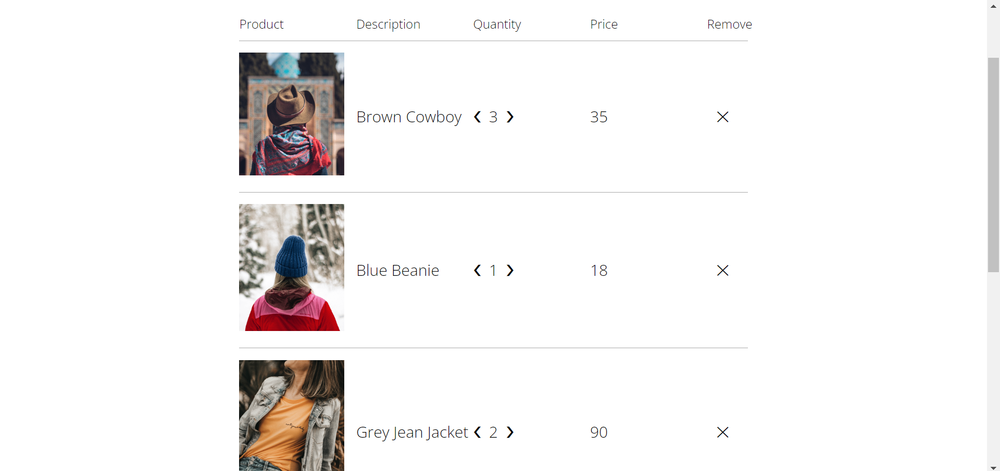
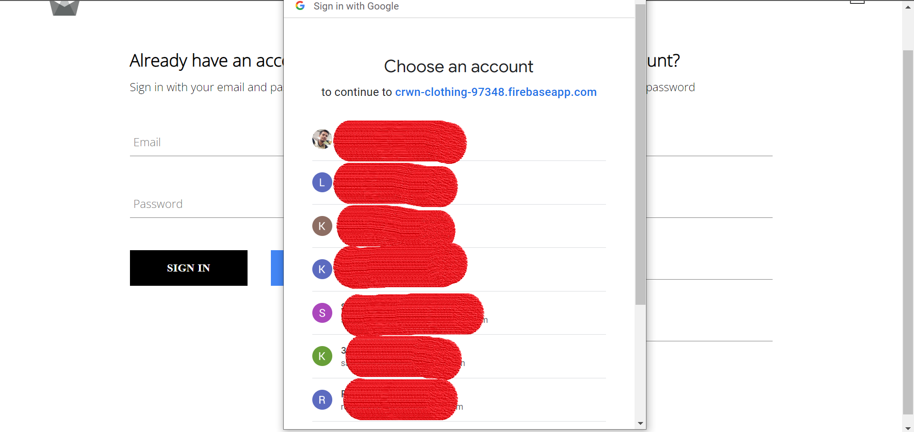

# All about this app - [Crwn-clothing](https://crwn-cloth-v2.netlify.app/)

## Preview

- Homepage

- Checkout Page

- Google Auth

- Stripe Payment

## This app built using :- 
- [Reactjs v18](https://reactjs.org/)
- [React Router v6](https://reactrouter.com/)
- [Redux](https://redux.js.org/)
- [Firebase Auth](https://firebase.google.com/docs/auth)
- [Firestore](https://firebase.google.com/docs/firestore)
- [Stripe Payment](https://stripe.com/docs/api)
- [Netlify](https://www.netlify.com/)

Thank you [Zero to Mastery academy](https://github.com/zero-to-mastery) for amazing Reactjs tutorial.